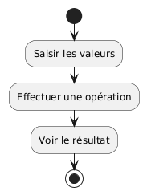
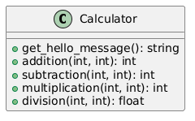
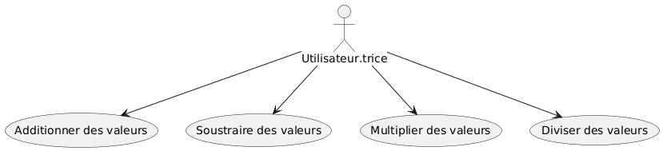
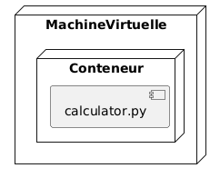

# Calculatrice - Documentation d'Architecture
Ce document, basé sur le modèle arc42, décrit une application calculatrice pour le Labo 00, LOG430.

## 1. Introduction et Objectifs

### Panorama des exigences
L'application « Calculatrice » est une application Python simple pour effectuer des opérations mathématiques de base (addition, soustraction, multiplication et division). Elle sert de projet éducatif pour démontrer :
- L'utilisation de conteneurs avec Docker
- L'écriture et l'exécution de tests automatisés avec pytest
- La mise en place d'un pipeline CI/CD avec GitLab et Docker
- L'accès à un serveur via SSH et la vérification des ressources computationnelles
- La combinaison d'outils de développement modernes (VS Code, Git, Docker)

Cette calculatrice est volontairement simple afin de se concentrer sur la création et la maintenance d'un pipeline CI/CD. L'architecture évoluera dans les laboratoires suivants.

### Objectifs qualité
| Priorité | Objectif qualité | Scénario |
|----------|------------------|----------|
| 1 | **Testabilité** | Tests automatisés avec pytest pour toutes les fonctions |
| 2 | **Déployabilité** | Pipeline CI/CD automatisé avec GitLab |
| 3 | **Maintenabilité** | Code simple et bien structuré pour faciliter l'évolution |

### Parties prenantes (Stakeholders)
- **Développeur.euses** : Apprendre les outils de développement modernes et les pipelines CI/CD
- **Utilisateur.trices** : Bénéficiaires des calculs mathématiques de base

## 2. Contraintes d'architecture

| Contrainte | Description |
|------------|-------------|
| **Technologie** | Utilisation de Python 3, Docker, pytest et GitLab CI/CD |
| **Déploiement** | Déploiement via conteneur Docker et pipeline GitLab |
| **Éducatif** | L'application doit démontrer clairement les concepts d'infrastructure et CI/CD |

## 3. Portée et contexte du système

### Contexte métier

Le système permet aux utilisateurs de :
- Effectuer des opérations mathématiques de base (addition, soustraction, multiplication, division)
- Exécuter l'application via ligne de commande
- Tester automatiquement les fonctionnalités

### Contexte technique
- **Application** : `calculator.py` - Script Python simple
- **Tests** : `test_calculator.py` - Tests automatisés avec pytest
- **Conteneurisation** : Docker Compose pour l'environnement de développement
- **CI/CD** : Pipeline GitLab pour tests et déploiement automatique

## 4. Stratégie de solution

| Problème | Approche de solution |
|----------|---------------------|
| **Environnement reproductible** | Utilisation de Docker et environnement virtuel Python |
| **Qualité du code** | Tests automatisés avec pytest |
| **Déploiement automatisé** | Pipeline CI/CD avec GitLab |
| **Surveillance des ressources** | Commandes système (top, free, df) |

## 5. Vue des blocs de construction

## 6. Vue d'exécution

## 7. Vue de déploiement

## 8. Concepts transversaux
- Conteneurisation avec Docker
- Tests automatisés avec pytest
- Pipeline CI/CD avec GitLab
- Déploiement via SSH
- Surveillance des ressources système

## 9. Décisions d'architecture
Veuillez consulter le fichier `/docs/adr/adr001.md`.

## 10. Exigences qualité

### Testabilité
- Tests automatisés pour toutes les fonctions mathématiques
- Exécution des tests dans le pipeline CI/CD
- Signalement claire des erreurs par pytest

### Déployabilité
- Pipeline automatisé GitLab avec étapes setup et checkout
- Déploiement automatique via SSH après succès des tests
- Vérification des ressources système sur le serveur cible

### Maintenabilité
- Code simple et bien documenté
- Structure modulaire pour faciliter l'évolution
- Conventions de nommage cohérentes

## 11. Risques et dettes techniques
Non applicable pour cette application.

## 12. Glossaire

| Terme | Définition |
|-------|------------|
| **CI/CD** | Continuous Integration/Continuous Deployment : pratiques d'automatisation du développement et déploiement des applications |
| **SSH** | Secure Shell : protocole de communication sécurisé pour l'accès à distance |